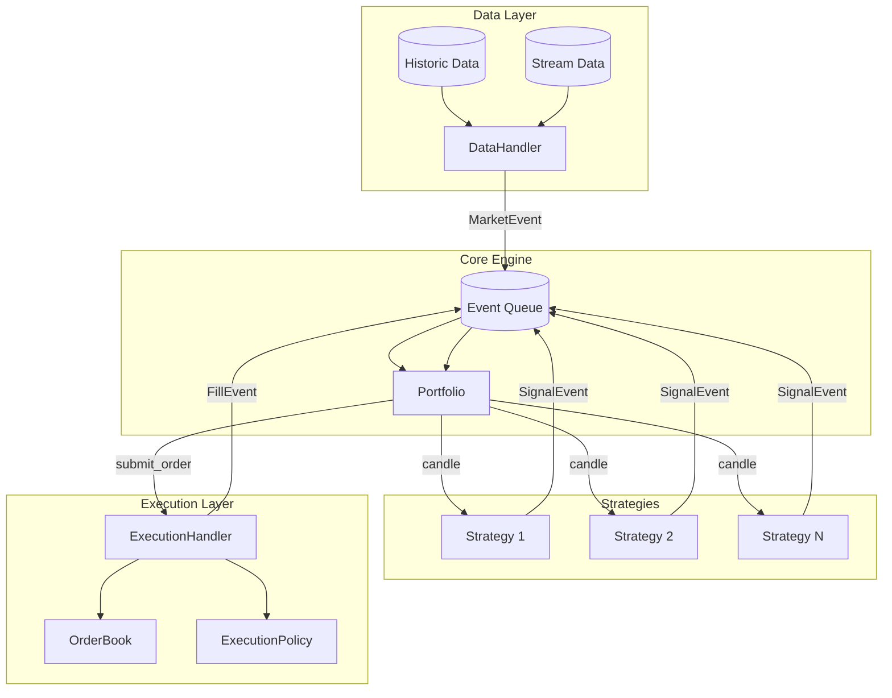
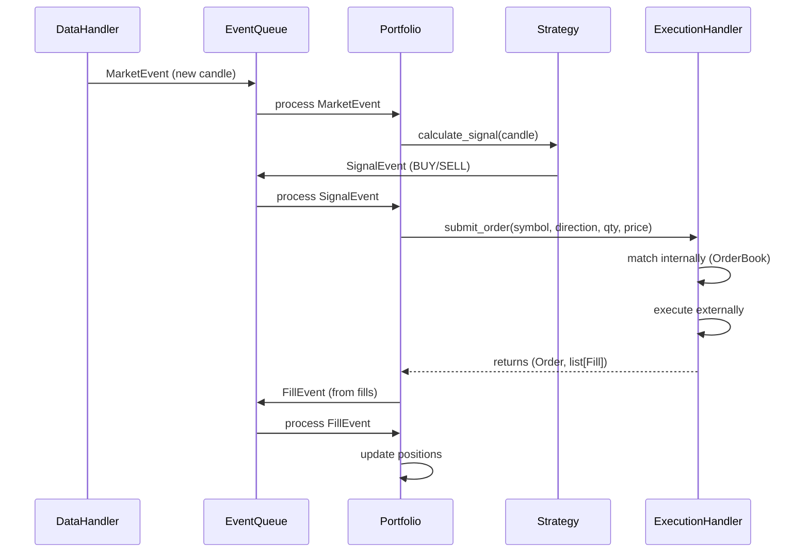
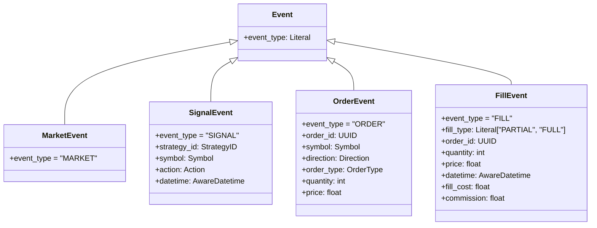
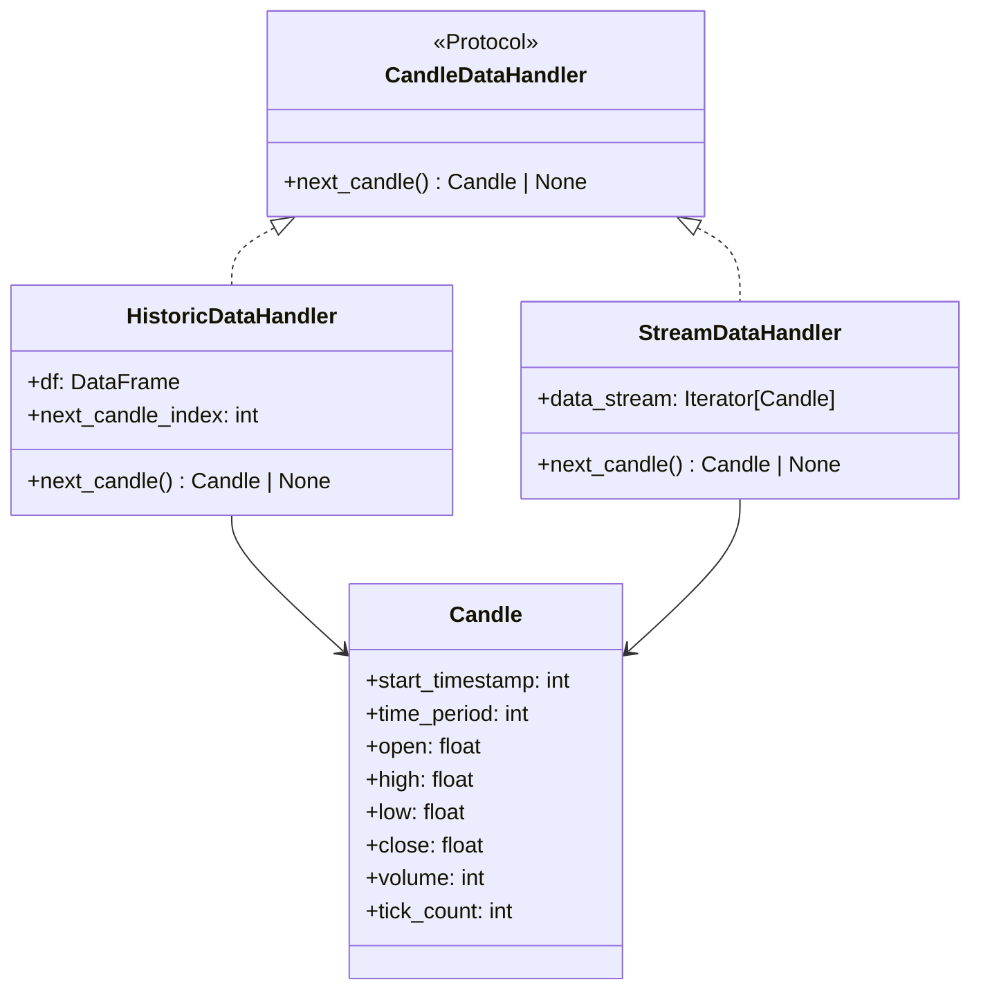
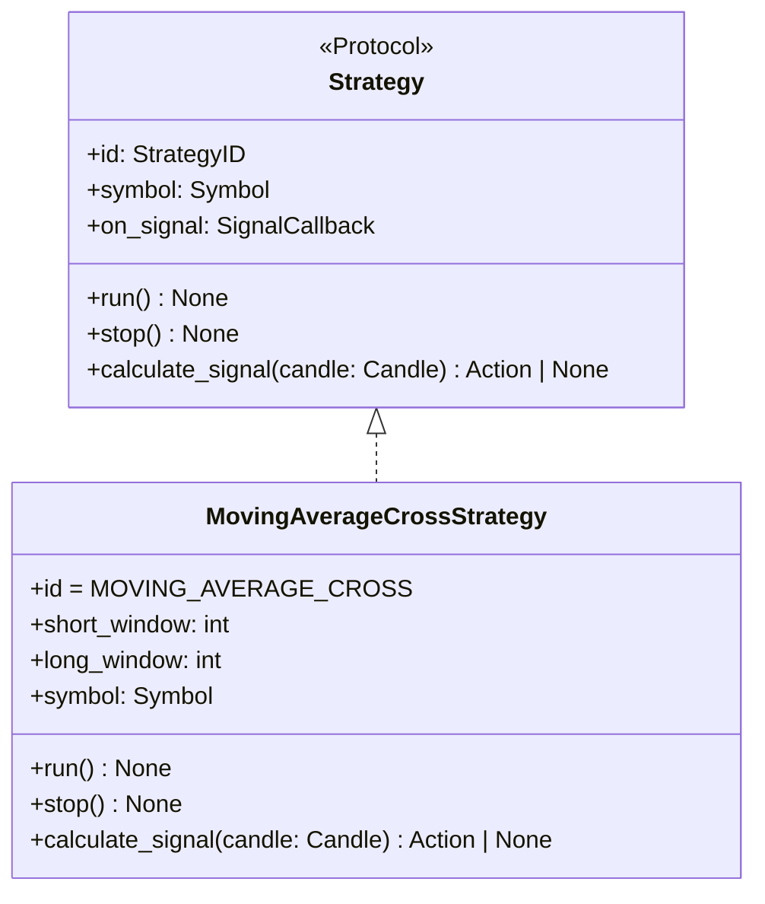
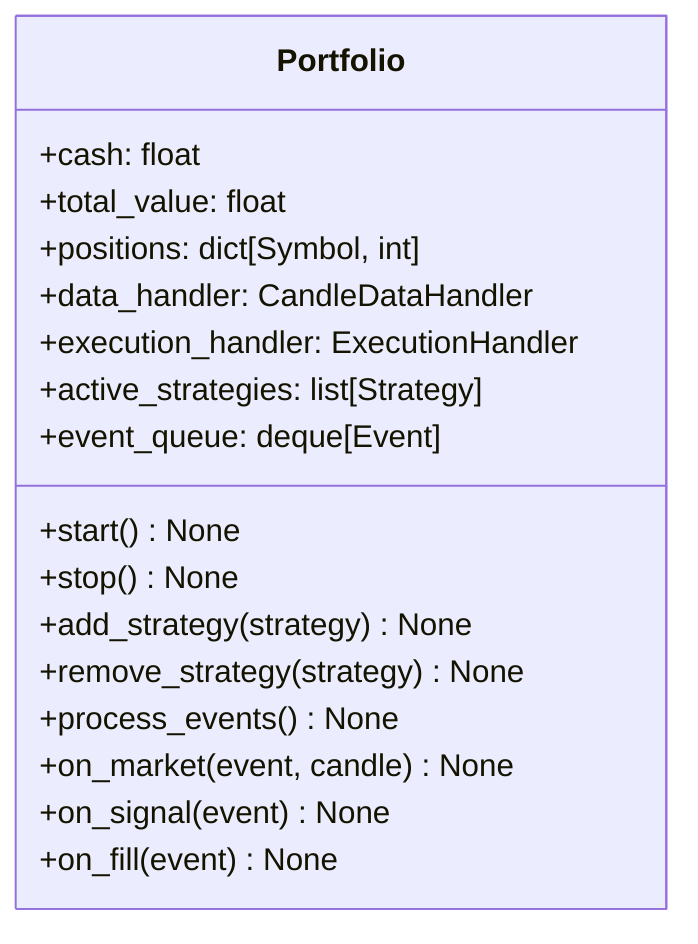
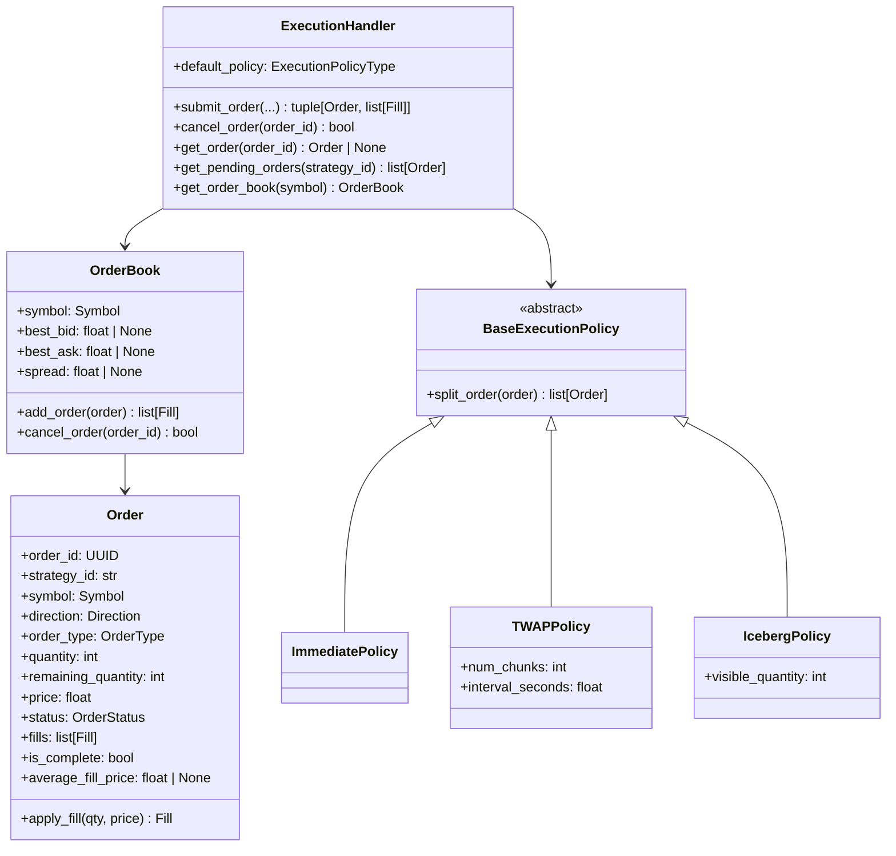
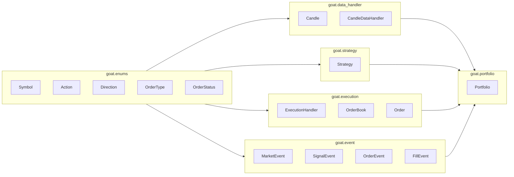

# GOAT Architecture Documentation

> **G**uler's **O**p **A**lgo **T**rading - Event-Driven Algorithmic Trading Bot

This document describes the architecture of the GOAT trading system, including component interactions, event flow, and usage patterns.

---

## Table of Contents

1. [System Overview](#system-overview)
2. [Event-Driven Architecture](#event-driven-architecture)
3. [Core Modules](#core-modules)
   - [Events](#events)
   - [Data Handler](#data-handler)
   - [Strategy](#strategy)
   - [Portfolio](#portfolio)
   - [Execution](#execution)
4. [Component Interactions](#component-interactions)
5. [Usage Example](#usage-example)

---

## System Overview

GOAT is an event-driven backtesting and trading framework. The system processes market data through a pipeline of components, each communicating via strongly-typed events.



---

## Event-Driven Architecture

The system is built around four event types that flow through a central event queue:



### Event Types

| Event | Trigger | Contains | Consumer |
|-------|---------|----------|----------|
| `MarketEvent` | New candle available | (minimal) | Portfolio → Strategy |
| `SignalEvent` | Strategy generates signal | symbol, action, strategy_id | Portfolio |
| `FillEvent` | Order executed | order_id, quantity, price, commission | Portfolio |

> **Note:** `OrderEvent` exists in the codebase but is not currently used in the event flow. 
> Portfolio directly calls `ExecutionHandler.submit_order()` instead of creating OrderEvents.

---

## Core Modules

### Events

**File:** `src/goat/event.py`

Defines the event hierarchy using Pydantic models for validation and serialization.



---

### Data Handler

**File:** `src/goat/data_handler.py`

Provides market data through a protocol-based abstraction.



**Usage:**
- `HistoricDataHandler`: For backtesting with historical DataFrame
- `StreamDataHandler`: For live trading with streaming data

---

### Strategy

**File:** `src/goat/strategy.py`

Defines the Strategy protocol and implementations.



**Key Concepts:**
- Strategies are stateless signal generators
- They receive candle data and emit Action signals (BUY/SELL)
- Multiple strategies can run concurrently on the same portfolio

---

### Portfolio

**File:** `src/goat/portfolio.py`

Central orchestrator that manages positions, strategies, and event flow.



**Responsibilities:**
- Maintains cash and position state
- Manages active strategies lifecycle
- Processes events from the queue
- Converts signals to orders based on position sizing
- Updates positions from fill events

---

### Execution

**File:** `src/goat/execution.py`

Handles order lifecycle, internal matching, and external execution.



**Execution Flow:**
1. Receive order from Portfolio
2. Apply execution policy (split into chunks if needed)
3. Attempt internal matching via OrderBook
4. Route remaining quantity to external execution
5. Return fills for position updates

---

## Component Interactions



---

## Usage Example

```python
from collections import deque
from goat.data_handler import HistoricDataHandler, Candle
from goat.event import MarketEvent, SignalEvent, FillEvent
from goat.execution import ExecutionHandler
from goat.portfolio import Portfolio
from goat.strategy import MovingAverageCrossStrategy
from goat.enums import Symbol, Direction, OrderType
import polars as pl

# 1. Setup data handler with historical data
df = pl.read_csv("historical_data.csv")
data_handler = HistoricDataHandler(df=df)

# 2. Setup execution handler
execution_handler = ExecutionHandler()

# 3. Create portfolio with initial cash
portfolio = Portfolio(
    cash=100_000.0,
    data_handler=data_handler,
    execution_handler=execution_handler,
)

# 4. Add strategy
strategy = MovingAverageCrossStrategy(
    short_window=10,
    long_window=30,
    symbol=Symbol.AAPL,
)
portfolio.add_strategy(strategy)

# 5. Main event loop
event_queue: deque = deque()

while True:
    # Get next candle
    candle = data_handler.next_candle()
    if candle is None:
        break
    
    # Emit market event
    event_queue.append(MarketEvent())
    
    # Process events
    while event_queue:
        event = event_queue.popleft()
        
        if event.event_type == "MARKET":
            # Feed candle to strategies
            for strat in portfolio.active_strategies or []:
                action = strat.calculate_signal(candle)
                if action:
                    signal = SignalEvent(
                        strategy_id=strat.id,
                        symbol=strat.symbol,
                        action=action,
                        datetime=candle.start_timestamp,
                    )
                    event_queue.append(signal)
        
        elif event.event_type == "SIGNAL":
            # Convert signal to order
            order, fills = execution_handler.submit_order(
                symbol=event.symbol,
                direction=Direction.BUY if event.action == Action.BUY else Direction.SELL,
                order_type=OrderType.LIMIT,
                quantity=10,
                price=candle.close,
                strategy_id=event.strategy_id,
            )
            # Queue fill events
            for fill in fills:
                event_queue.append(FillEvent(
                    fill_type="FULL" if order.is_complete else "PARTIAL",
                    order_id=fill.order_id,
                    quantity=fill.quantity,
                    price=fill.price,
                    datetime=fill.timestamp,
                ))
        
        elif event.event_type == "FILL":
            # Update portfolio positions
            portfolio.cash -= event.quantity * event.price
            # Update position tracking...

# 6. Stop all strategies
portfolio.stop()
```

---

## Enums Reference

| Enum | Values | Used By |
|------|--------|---------|
| `Symbol` | AAPL, TSLA | All modules |
| `Action` | BUY, SELL | Strategy signals |
| `Direction` | BUY, SELL | Order direction |
| `OrderType` | LIMIT, MARKET | Order specification |
| `OrderStatus` | PENDING, OPEN, PARTIALLY_FILLED, FILLED, CANCELLED | Order lifecycle |
| `ExecutionPolicyType` | IMMEDIATE, TWAP, ICEBERG | Order execution |

---

## Further Reading

- See `tests/test_execution.py` for comprehensive examples of order and execution behavior
- See `tests/test_event.py` for event validation examples
